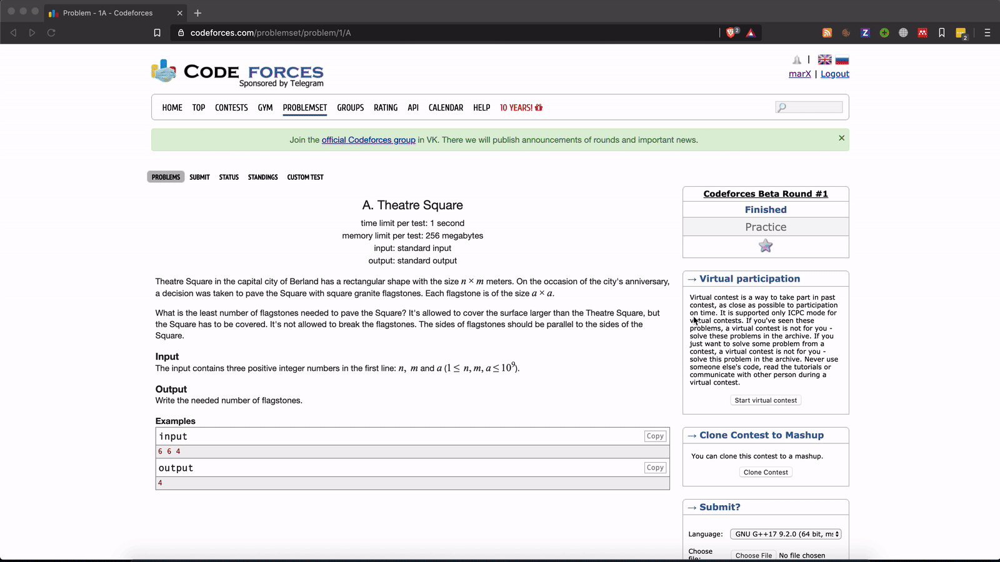

# ACMX

   

**acmX** is tool that empower contestants to solve competitive programming problems easily.

### Features

* Contest/Problem parsing. (Via [Competitive-Companion](https://github.com/mfornet/acmx/wiki#competitive-companion) extension).
* Running solution against testcases.
* Automatic verdict results (OK, WA, RTE, TLE, CE).
* Manage testcases easily.
* Stressing solution against brute solution using a generator (Useful to find corner cases).
* Support for multiple languages.

## Documentation

Check [the wiki](https://github.com/mfornet/acmx/wiki) for details about all features and help.

## Getting started

**acmX** have been designed to run automatically boilerplate actions repeated often in competitive programming. Next is the expected pipeline to interact with it.

1. Install the extension from the [marketplace](https://marketplace.visualstudio.com/items?itemName=marx24.acmx).

2. Install competitive companion.

3. Open online contest/problem you want to solve and parse with competitive-companion extension. All problems along with the testcases are downloaded and you are ready to code.

4. Work on your solution on `sol.cpp`.

5. After you finish call `Run` and automatically your program will be compiled and run against every testcases. If the solutions is correct, it will be reported as `Ok` otherwise you will see failing test case. You can always go back to original layout calling `View: Code`.

## Join the conversation

We have a group to discuss about this tool in [Telegram](https://t.me/acm_x).

## Contributing

The easiest was to contribute is giving a star to the [github repository](https://github.com/mfornet/acmx) and to the [extension in the marketplace](https://marketplace.visualstudio.com/items?itemName=marx24.acmx) if you found the extension useful.

If you found a bug using the extension or have some suggestion [open an issue](https://github.com/mfornet/acmx/issues) to discuss about it.

If you want to implement some feature but you are not sure where to start check [good first issues](https://github.com/mfornet/acmx/issues?q=is%3Aissue+is%3Aopen+label%3A%22good+first+issue%22). You can join [dev channel](https://t.me/acm_x_dev) in Telegram too.
